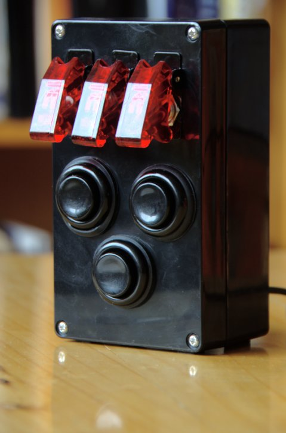
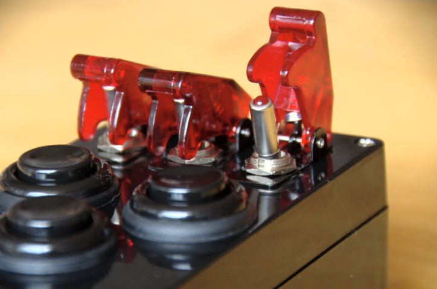
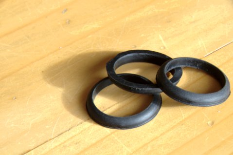
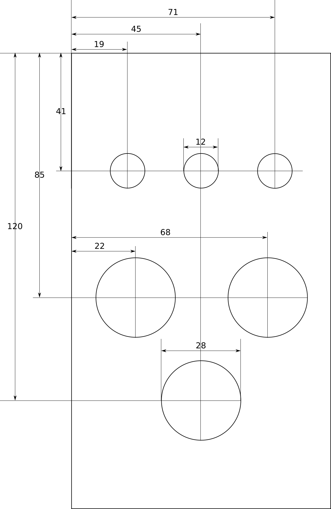
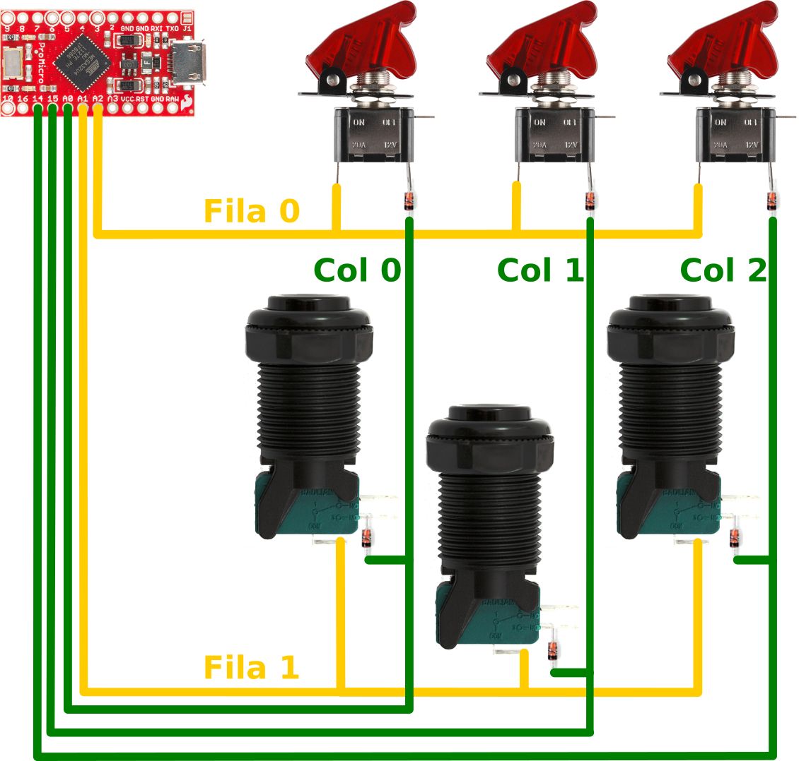

# Introducción

La botonera es un caja compuesta de una serie de interruptores, que pueden ser
usados para hacer que ciertos controles de la nave se hagan "más físicos",
facilitando de esta forma el pilotaje de la nave en Star Citizen. Por ejemplo,
se puede usar para subir y bajar el tren de aterrizaje, prender y apagar la
nave, bajar y subir los escudos y todos lo que se quiera.

Esta es una guía que describe como hacer la botonera (o buttton box) para el
juego de simulación espacial *Star Citizen* como se ve en la siguiente imagen:

\


Está compuesta de una serie de interruptores como se ve en el detalle
siguiente:

\


La botonera tiene muy poquitos botones, sólo seis, pero es fácilmente
extensible a más interruptores.

La botonera se conecta por cable USB al PC y el computador la reconoce como un
Joystick de solo botones, sin ejes, sin entrar en conflicto con otros dispositivos
conectados, sino al contrario, complementándolos.

La botonera sirve para  otros juegos de PC que funcionen con Joystick, pero no
los he probado con otros juegos.

# Habilidades necesarias para construir la botonera

Básicamente necesitas tener las siguientes habilidades. Si no las tienes
estas pueden aprenderse, sólo una (la programación en C++) es compleja y
requiere tiempo para aprenderla, pero, no te preocupes, si sigues los pasos de
esta guía no deberías haber problema. O la otra opción es tener un amigo que
tenga las habilidades que te faltan y te ayude.

1. Saber manejar un taladro.
1. Saber hacer soldadura electrónica.
1. Programación de Arduino (en C++), esta habilidad es deseable pero no
  obligatoria por que el programa te lo doy y si sigues los pasos no debe
  presentarse problemas mayores.

# Los materiales necesarios

* 3 interruptores con cubierta, estos interruptores son los que llaman *lanza
misiles* y son los que inspiraron este proyecto.

  )](images/ToggleSwitchAndCover-300x300.jpg)

* 3 interruptores para arcade. Los hay de varios colores, puedes seleccionar los
  que gustes.

  )](images/ConcaveButton-300x300.jpg)

* 6 diodos. Esto se usa por que se van a poner los interruptores en forma de
  matriz y con los diodos evitamos falsos positivos al oprimir varios
  interruptores a la vez.

)](images/DiodeSmallSignal-300x300.jpg)

* Cables de al menos dos colores distintos. Esto para poder diferenciar filas de columnas.

)](images/Hook-upWire-Yellow-300x300.jpg)

* Arduino Pro Micro, el "cerebro" de la botonera. Hay dos versiones, una de 3.3V
y una de 5V. Yo hice la botonera con la versión de 3.3V, pero con la de 5V debe
funcionar.

](images/ProMicro-300x300.jpg)

* Cable USB micro-B Cable. La longitud depende de lo que necesites para conectar
  la botonera a tu PC.

)](images/USBmicro-BCable-300x300.jpg)

* Soldadura electrónica.

)](images/SolderLeaded-15-gramTube-300x300.jpg)

* FLux para facilitar la soldadura, esta versión es como un marcador de tablero.

)](images/14579-Chip_Quik_No-Clean_Flux_Pen_10mL-01-300x300.jpg)

* 1 caja para proyecto electrónico de 6.2 x 3.54 x 2.3 pulgadas. Pero esta se me
  quedo algo corto de profundidad para los interruptores de arcade y tocó
  ponerles unas juntas tóricas para darles más altura a los interruptores.

)](images/caja.jpg)

* Juntas o también llamados empaques. Estos fueron necesarios por que los
  interruptores de arcade no cabían en la caja por solo unos milímetros. Estos
  hay que comprarlos de tal forma que queden alrededor de interruptor sin
  pasarse.



## Donde comprar

Esto son solo recomendaciones, estos son los sitios donde yo compré (principalmente
  Sparkfun), pero puedes comprar donde te apetezca. En la siguiente tabla la
  columna de *Donde comprar* contiene los enlaces a la página de cada producto.

|Cant. | Elemento                       | Donde comprar |
|------|--------------------------------|-------------------------------------------------------------------------------------------------------------|
|    3 | Interruptores con cubierta     | [Sparkfun: Toggle Switch and Cover](https://www.sparkfun.com/products/11310) |
|    3 | Interruptores para arcade      | [Sparkfun: Concave Button](https://www.sparkfun.com/products/9339) |
|    6 | Diodos                         | [Sparkfun: Diode Small Signal](https://www.sparkfun.com/products/8588) |
|    2 | Cables                         | [Sparkfun: Hook-up Wire - Yellow](https://www.sparkfun.com/products/8024) |
|    1 | Arduino Pro Micro              | [Sparkfun: Pro Micro - 3.3V/8MHz](https://www.sparkfun.com/products/12587) |
|    1 | Cable USB micro-B Cable        | [Sparkfun: USB micro-B Cable](https://www.sparkfun.com/products/10215) |
|    1 | Soldadura                      | [Sparkfun: Solder Leaded - 15-gram Tube](https://www.sparkfun.com/products/9162) |
|    1 | FLux para soldadura            | [Sparkfun: Chip Quik No-Clean Flux Pen - 10mL](https://www.sparkfun.com/products/14579) |
|    1 | Caja para proyecto electrónico | [Amazon: Caja de plástico 6.2 x 3.54 x 2.3 pulgadas](https://www.amazon.com/-/es/gp/product/B07TS6RY85/ref=ppx_yo_dt_b_asin_title_o00_s00) |
|    3 | Juntas o empaques              | En la ferretería más cercana. |
     
# Herramientas recomendadas

Estas herramientas son recomendadas, tu eres libre de comprar las que realmente
necesites.

* Soldador de estaño. Puede servir cualquiera, pero recomiendo uno que tenga
  base donde ponerlo y no quemar la mesa y además que tenga control de
  potencia para no quemar elementos basados en silicio, como el *Pro Micro* y
  los diodos como el que se ve a continuación:

)](images/WellerWLC100SolderingStation-300x300.jpg)


* Brocas par abrir agujeros. Estas brocas son muy útiles pues sirven para
  madera, metal y plástico, y los agujeros quedan muy prolijos. Además trae un
  punzón o también llamado centro-punto que sirve para dar precisión al centro  
  del agujero.

)](images/TACKLIFEJuegoDe5BrocasDeTitanio-341x300.jpg)

* Tercera mano. Es una aparato con pinzas para sostener las partes a soldar y
  con eso no tienes la necesidad de tener una tercera mano.

)](images/ThirdHand-300x300.jpg)

* Pinzas corta cable. Estas se necesitan para cortar los restos de cable o
  alambre que quedan sobrando después de soldar.

)](images/FlushCutters-300x300.jpg)

* Tapete aislante para soldar. Este tapete es totalmente opcional, puedes soldar
  sin él, pero es muy bueno para proteger tu mesa de quemaduras producidas por
  el soldador, además tiene una serie de cajones pequeños donde puedes poner las
  partes pequeñas y que no caigan de la mesa perdiéndose.

)](images/InsulatedSiliconeSolderingMat-300x300.jpg)


## Donde comprar

Esto son solo recomendaciones, estos son los sitios donde yo compré (principalmente
  Sparkfun), pero puedes comprar donde te apetezca. En la siguiente tabla la
  columna de *Donde comprar* contiene los enlaces a la página de cada producto.

 Cant. Elemento                       Donde comprar
------ ------------------------------ ---------------
     1 Soldador de estaño             [Amazon: Weller WLC100 Estación de soldadura de 40 W](https://www.amazon.com/-/es/gp/product/B000AS28UC)
     1 Brocas par abrir agujeros      [Amazon: TACKLIFE - Juego de 5 brocas de titanio](https://www.amazon.com/-/es/gp/product/B0746FZT52)
     1 Tercera mano                   [Sparkfun: Third Hand](https://www.sparkfun.com/products/9317)   
     1 Pinzas corta cable             [Sparkfun: Flush Cutters - Xcelite](https://www.sparkfun.com/products/14782)
     1 Tapete aislante para soldar.   [Sparkfun: Insulated Silicone Soldering Mat](https://www.sparkfun.com/products/14672)

# Armado

El armado de la botonera consta de varios pasos que se detallan a continuación.


## Hacer los agujeros para los interruptores

Para hacer los agujeros hice una plantilla que es la siguiente:

\


Te dejo un enlace al pdf **[plantilla](boxDesign.pdf)** para que puedas imprimirlo,
recortarlo y pegarlo sobre la tapa de la caja para que guiarte para los agujeros.
Para esto debes:

1. Recortar la plantilla por los bordes de la caja.
1. Pegar la plantilla en la tapa de la caja de tal forma que quede firme pero
  que sea fácil de despegar después.
1. Poner el punzón (o centro punto como lo llaman en otros lugares) que viene
  en el kit de brocas y poniendo la punta en los centros de los círculos apretar
  fuertemente hasta que salte el resorte.
1. Quitar la plantilla verificando que los centros hayan quedado marcados.
1. Con un broca muy delgada hacer un agujero en estas  marcas.
1. Ahora si, con una de las brocas que van hasta 1/2 haz los agujeros de los
  interruptores de misiles. De todos modos verifica que uses el ancho adecuado
  de la broca, pues pueda pasar que tus interruptores sean distintos. Si hay
  duda utiliza un tamaño más pequeño.
1. Ahora con la broca más grande haces los de los interruptores de arcade,
  pero ten cuidado se solo llevarla hasta 1 1/8. Recuerda verificar que uses el
  ancho adecuado de la broca, pues pueda pasar que tus interruptores sean
  distintos. Si hay duda utiliza un tamaño más pequeño.
1. Por detrás y con un procedimiento similar haz el agujero del cable USB,
  también usa una de las brocas que van hasta 1/2. Recuerda verificar con tu
  conector USB que uses el ancho adecuado de la broca, pues cada conector es
  distinto.

## Colocar los interruptores

Ahora tienes que colocar los interruptores en los agujeros:

### Para poner los interruptores de *lanzar misiles*

1. Debes quitarles la primera tuerca y la cubierta, dejando una tuerca y una
  arandela.
1. la tuerca que le dejas debe quedar muy cerca del cuerpo del interruptor.
1. Ahora pones el interruptor desde adentro de la caja.
1. Pones la cubierta del interruptor desde afuera de la caja y
1. aseguras poniendo la tuerca que quitemos desde afuera da la caja.
1. Verifica que en interruptor esté correctamente orientado.
1. Aprietas la tuerca con los dedos o con una llave de tuercas, pero en este
  caso suavemente.

### Para poner los interruptores de arcade

1. Debes quitar el microswitch que tiene al final el interruptor, fíjate antes
  como está puesto.
1. Ahora debes quitar la tuerca.
1. Desde afuera de la caja pon el interruptor en el agujero.
1. Pon la tuerca, todavía no al aprietes.
1. Pon el microswitch como estaba antes y
1. Cuidando la orientación del microswitch, ahora si aprieta la tuerca.

## Conexiones

Una vez colocados los interruptores en la caja, y no antes, debes conectar
soldando en  la forma en como se ve en la siguiente figura [^SparkfunLicence]:

\


[^SparkfunLicence]: Las imágenes de los interruptores y del *Pro Micro* son tomadas de la página
de [Sparkfun](https://www.sparkfun.com) donde tiene una licencia *Attribution 2.0 Generic (CC BY 2.0)*


Lo más importante aquí es que los diodos te queden orientados correctamente,
como se ve en la figura, estos tienen una franja negra esta debe quedar hacia
afuera del interruptor, dicho de otra forma, la franja negra debe quedar cerca
del cable verde de la columna respectiva. Si te queda al revés ese interruptor
no funcionará, si te pasa es fácil de solucionar, solo es desoldar el diodo y
volverlo a soldar en el otro sentido.

### ¿Por qué se conecta de esta forma?

Esta forma de conectar los interruptores es en forma de matriz, esto se hace
para ahorrar conexiones al microcontrolador *Pro Micro*. Si se conectara cada
interruptor individualmente se usarían seis conexiones y en forma de matriz se
usan cinco, se ahorra una conexión.

Se bien esto no parece impresionante, solo un cable menos, hay que tener en
cuenta que esta botonera es un primer prototipo que abre el camino para
botoneras mucho más grandes. Por ejemplo, si se tuviera una botonera de 36
interruptores organizados en una matriz de 6x6, se tendrían 12 conexiones al
*Pro Micro* que es mucho menos que las 36 conexiones que se requerirían al
conectar los interruptores individualmente.

Entonces en nuestro caso tenemos organizados los interruptores en una matriz de
2x3, dos filas y dos columnas. La primera fila son los tres interruptores *lanza
misiles* y la segunda la de arcade. Estas filas se numeran desde cero,
existe la fila cero y la fila uno. Y además se tienen tres columnas numeradas
también desde cero, estan la cero, uno y dos.

# Cargar el firmware de la botonera


Este es el firmware de la botonera, el sofware para que el Arduino Pro Micro
pueda procesar las acciones de los interruptores y convertirlos en acciones del
del joystick.

## Instalar el IDE de Aduino

TODO: Hacerlo para windows

## Instalando la librería joystick

TODO

## Abrir el código

TODO

### Una explicación del código

Esta parte no es necesaria para hacer funciona las botonera, sólo está aqui
para los que saben programación o que sienten curiosidad por conocer la lógica
de la botonera.

El código es el siguiente:

```C++
#include <Keypad.h>
#include <Joystick.h>

const byte NUMROWS = 2;
const byte NUMCOLS = 3;
const byte MAXKEYS = NUMROWS * NUMCOLS;

byte keys[NUMROWS][NUMCOLS] = {
  {0, 1, 2},
  {3, 4, 5}
};
byte rowPins[NUMROWS] = {21, 20};
byte colPins[NUMCOLS] = {19, 18, 15};

Keypad kpd = Keypad( makeKeymap(keys), rowPins, colPins, NUMROWS, NUMCOLS );

Joystick_ joystick(
                    JOYSTICK_DEFAULT_REPORT_ID,

                    // "normal" joystick
                    JOYSTICK_TYPE_JOYSTICK,

                    // Six buttons
                    MAXKEYS,

                    // No hat
                    0,

                    // No axis
                    false, false, false, false, false, false, false, false, false, false, false
                  );


void setup() {
    joystick.begin();
}


void loop() {
    // Fills kpd.key[ ] array with up-to 6 active keys.
    // Returns true if there are ANY active keys.
    if (kpd.getKeys()) {
      // Scan the whole key list.
      for (int i = 0; i < MAXKEYS; i++) {
        // Only find keys that have changed state.
        if ( kpd.key[i].stateChanged ) {
          byte code = kpd.key[i].kchar;
          // Report active key state : PRESSED or RELEASED
          switch ( kpd.key[i].kstate ) {
              case PRESSED:
                joystick.pressButton(code);
                break;
              case RELEASED:
                joystick.releaseButton(code);
                break;
          }
        }
      }
    }
}  // End loop
```

Ahora mirémoslo punto por puntp. El siguiente código:

```C++
#include <Keypad.h>
#include <Joystick.h>
```

Son las dos librerías necesarias. La primera librería la ```Keypad.h``` se usa
para "leer" los interruptores, funciona en forma de matriz. La segunda librería
la ```Joystick.h``` [^ArduinoJoystickLibrary] es usada para simular las acciones \
de un joystick, en este caso para simular el accionar los interruptores de un
joystick.

El siguiente código:

```C++
const byte NUMROWS = 2;
const byte NUMCOLS = 3;
const byte MAXKEYS = NUMROWS * NUMCOLS;
```

Declara tres variables. La primera ```NUMROWS``` contiene el número de columnas
de la botonera. La segunda ```NUMCOLS``` contiene el número de filas de la
botonera. Y la tercera ```MAXKEYS``` el numero total de teclas, que es el
numero de filas multiplicado por el de columas.

El código:

```C++
byte keys[NUMROWS][NUMCOLS] = {
  {0, 1, 2},
  {3, 4, 5}
};
```

Es la declaración de la matriz de teclas, a cada una le ponemos un numero que
comienza desde cero. Se podría poner cualquier cosa, pero con esta numeración
vamos a ahorrar algo de código.

El siguiente código:

```C++
byte rowPins[NUMROWS] = {21, 20};
byte colPins[NUMCOLS] = {19, 18, 15};
```

Son dos arreglos que contienen los pines a los que está conectados las
respectivas filas y columnas. En el *Pro Micro*  los pines se numeran como se
ve en la siguiente figura:


Como se pude ver de la figura y del código el fila cero está conectada al pin
21, que también se llama ```A3```, la fila uno al pin 20 (```A2```). Por su
parte la columna cero está conectada al pin 10 (```A1```), la fila uno al 18
(```A0```) y la fila dos a 15.

En el siguiente código:

```C++
Keypad kpd = Keypad( makeKeymap(keys), rowPins, colPins, NUMROWS, NUMCOLS );
```

Se declara al objeto ```kpd``` que es el encargado de leer el estado de los
interruptores. Se le pasa como parámetros lo siguiente: Primero el mapa de
teclas. Segundo el arreglo de pines de las filas. De tercero también un arreglo
pero en esta ocasión de los pines de las columnas. De cuarto parámetro se pasa
el numero de filas. Y finalmente, como quinto parámetro, el numero de columnas.

En el  siguiente código:

```C++
Joystick_ joystick(
                    JOYSTICK_DEFAULT_REPORT_ID,

                    // "normal" joystick
                    JOYSTICK_TYPE_JOYSTICK,

                    // Six buttons
                    MAXKEYS,

                    // No hat
                    0,

                    // No axis
                    false, false, false, false, false, false, false, false, false, false, false
                  );
```

Se declara el objeto ```joystick```. El primer parámetro ```JOYSTICK_DEFAULT_REPORT_ID```
es el id para que el sistemas operativo para identificar el joystick, esta
constante es id por omisión de los joystick.

El segundo parámetro ```JOYSTICK_TYPE_JOYSTICK``` es para
especificar que es un joystick normal. También se puede poner un mando de video
juegos o un multiejes, para manejar un total de 11 ejes [^ArduinoJoystickLibrary].

El tercer parámetro ```MAXKEYS``` es el numero total de botones. Y en nuestro
caso esta constante tiene el numero 6.

El cuarto parámetro es el numero de hats, esto es, el numero de crucetas de un
mando, esto quiere decir que esta librería es capaz de emular un mando de
consola de vídeo juego, como la botonera no tiene se pone cero [^ArduinoJoystickLibrary].

Del quinto parámetro en adelante se especifica el numero de ejes que se activan,
como la botonera no tiene se ponen todos en falso. Esta librería aparte de los
seis ejes es también capaz de emular los ejes de la palanca de gases, un
acelerador, un freno y otros [^ArduinoJoystickLibrary].

El código que viene a con continuación:

```C++
void setup() {
    joystick.begin();
}
```

Es la función que inicializa el *Pro Micro*, lo unico que hace es inicalizar el
joystick.

El siguiente codigo:

```C++
void loop() {
    // Fills kpd.key[ ] array with up-to 6 active keys.
    // Returns true if there are ANY active keys.
    if (kpd.getKeys()) {
      // Scan the whole key list.
      for (int i = 0; i < MAXKEYS; i++) {
        // Only find keys that have changed state.
        if ( kpd.key[i].stateChanged ) {
          byte code = kpd.key[i].kchar;
          // Report active key state : PRESSED or RELEASED
          switch ( kpd.key[i].kstate ) {
              case PRESSED:
                joystick.pressButton(code);
                break;
              case RELEASED:
                joystick.releaseButton(code);
                break;
          }
        }
      }
    }
}
```

Es la función principal del programa. Lo que hace es lo siguiente: Llama a la
función ```kpd.getKeys()``` que lee todos los interruptores e inicializa una
arreglo con el estado de cada uno. Luego recorre ese arreglo para ver si el
estado del algún interruptor a cambiado con ```kpd.key[i].stateChanged ```. Si
es al caso mira si ha sido presionado (```PRESSED```) o soltado (```RELEASED```).
En el primer caso oprime el botón respectivo del joystick con ```joystick.pressButton(code)```.
El código es el numero que pusimos en la matriz de interruptores. En el otro
caso cuando es liberado el interruptor o cuando es puesto a apagado (si es un
interruptor de *lanzar misiles*) si simula la liberación de un botón del
joystick con ```joystick.releaseButton(code)```. Y como la función es un ciclo
(loop) se vuelve a empezar.

[^ArduinoJoystickLibrary]: Si quieres saber más sobre la librería joystick puedes
mirar su documentación en git [MHeironimus/ArduinoJoystickLibrary](https://github.com/MHeironimus/ArduinoJoystickLibrary)

## Cargar el firmware en la botonera

TODO

# Configurar la botonera

TODO

## Configurar *Control my Joystick*

TODO

## configurar los interruptores en Star Citizen

TODO
